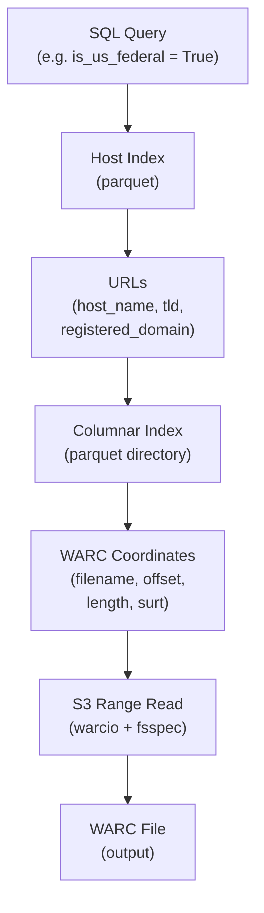

# build_custom_warc

Build custom WARC files from Common Crawl indexes.

## Pipeline



## Usage

```bash
python build_custom_warc.py \
    --columnar-index "s3://commoncrawl/cc-index/table/cc-main/warc/*.parquet" \
    --host-index ~/cc-host-index/ \
    --output custom.warc.gz \
    --limit 10
```

## Options

| Option             | Description                                                                                                                        |
|--------------------|------------------------------------------------------------------------------------------------------------------------------------|
| `--columnar-index` | Path/URI to the columnar index parquet files (provides `warc_filename`, `warc_record_offset`, `warc_record_length`). **Required.** |
| `--host-index`     | Path to the host-level index parquet file(s). **Required.**                                                                        |
| `--output`         | Output WARC file path (default: `custom.warc.gz`).                                                                                 |
| `--limit`          | Maximum number of hosts to process (default: no limit).                                                                            |
| `--homepage`       | Fetch only the homepage (`url_path = '/'`) of each host.                                                                           |
| `--warc-prefix`    | Base URI prefix for source WARC files (default: `s3://commoncrawl`).                                                               |

## How it works

Records are fetched **directly from S3 via range reads** using [`warcio`](https://github.com/webrecorder/warcio)
and `fsspec`/`s3fs` — no full WARC downloads. The columnar index gives the exact
`warc_record_offset` and `warc_record_length` of each capture, so for every source file the tool:

1. Opens `s3://commoncrawl/{warc_filename}` once (records are sorted by offset to keep seeks forward).
2. Seeks to `warc_record_offset` and reads `warc_record_length` bytes.
3. Decodes that slice as a single gzip member (Common Crawl WARCs are multi-member gzip, so each
   byte range is one self-contained record) and appends it to the output WARC.

The output file starts with a `warcinfo` record and is gzip-compressed.

Accessing `s3://commoncrawl` requires AWS credentials (or anonymous-access configuration) in the
environment. Use `--warc-prefix` to point at a mirror or local copy if needed.
