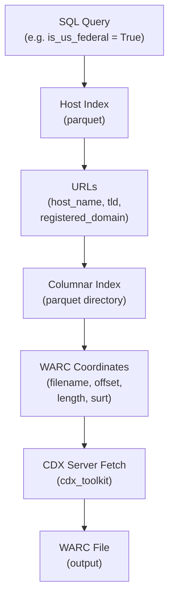

# build_custom_warc

Build custom WARC files from Common Crawl indexes.

## Pipeline



## Usage

```bash
python build_custom_warc.py \
    --columnar-index "s3://commoncrawl/cc-index/table/cc-main/warc/*.parquet" \
    --host-index ~/cc-host-index/ \
    --limit 10
```
